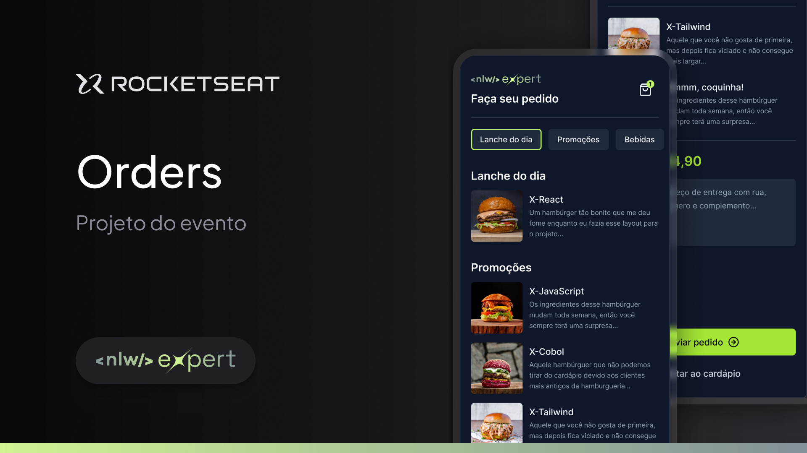

<h1 align="center">
 NLW Expert 👨🏼‍🚀
</h1>

<p align="center">
  <a href="#-sobre-o-projeto">Sobre</a> •
  <a href="#-funcionalidades">Funcionalidades</a> •
  <a href="#-rodando-a-aplicação">Rodando a aplicação</a> •
  <a href="#-layout">Layout</a> •
  <a href="#-tecnologias">Tecnologias</a> 
</p>

<br/>



## 💻 Sobre o projeto

Projeto desenvolvido durante o evento NLW Expert da [Rocketseat](https://www.rocketseat.com.br/), um app de delivery para lanchonetes.

---

## ⚙️ Funcionalidades

- Listar produtos
- Detalhes do produto
- Adicionar e Remover itens do carrinho
- Deletar itens do carrinho
- Enviar pedido pelo whatsaapp

---

## 🧭 Rodando a aplicação

```bash
# Clone este repositório

$ git clone https://github.com/frantecbh/app-delivery-nlw
```

```bash
# Instale as dependências
$ npm install ou yarn

# crie um arquivo .env.local baseado no arquivo .env.example
# preencha o valor da variável

# Execute a aplicação
$ npx expo start
```

---

## 🔖 Layout

Você pode visualizar o layout do projeto através [desse link](<https://www.figma.com/file/eKqdOqxjYWqRB6UqjzY7YW/NLW-expert-%E2%80%A2-Orders-(Community)?type=design&node-id=2-287&mode=design&t=oj65oGrqeMi6TBZI-0>). É necessário ter conta no [Figma](http://figma.com/) para acessá-lo.

---

## 🚀 Tecnologias

As seguintes ferramentas foram usadas na construção do projeto:

- Tailwind
- React
- React Native
- Expo
- Typescript
- CLSX
- Zustand
